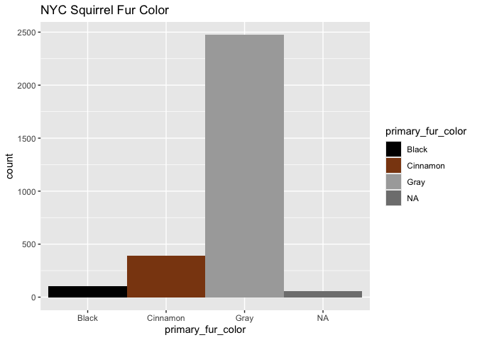

Portfolio Piece 01
================
Lilly McClendon
2025-02-07

#### The purpose of Portfolio Piece 1 is to create plots of squirrel sightings in New York City and pizza locations in New York City. Using that data, use latitutde and longitude from both databases to see if there is a visual connection between squirrel sightings and pizza shop locations. Then the data will be transformed.

### Data Credits

[Data from NYC Squirrel Census](https://www.thesquirrelcensus.com/).
Retrieved from
[jonthegeek](https://github.com/rfordatascience/tidytuesday/tree/main/data/2019/2019-10-29)
originally shared by Sara Stoudt. [Pizza
Data](https://raw.githubusercontent.com/rfordatascience/tidytuesday/master/data/2019/2019-10-01/pizza_datafiniti.csv%22)

### Load squirrel data and packages

``` r
library(tidyverse) 
```

``` r
nyc_squirrels <- readr::read_csv("https://raw.githubusercontent.com/rfordatascience/tidytuesday/main/data/2019/2019-10-29/nyc_squirrels.csv")
```

    ## Rows: 3023 Columns: 36
    ## ── Column specification ────────────────────────────────────────────────────────
    ## Delimiter: ","
    ## chr (14): unique_squirrel_id, hectare, shift, age, primary_fur_color, highli...
    ## dbl  (9): long, lat, date, hectare_squirrel_number, zip_codes, community_dis...
    ## lgl (13): running, chasing, climbing, eating, foraging, kuks, quaas, moans, ...
    ## 
    ## ℹ Use `spec()` to retrieve the full column specification for this data.
    ## ℹ Specify the column types or set `show_col_types = FALSE` to quiet this message.

### Squirrel fur color visualization

``` r
ggplot(data=nyc_squirrels, aes(x=primary_fur_color, fill = primary_fur_color)) + 
  geom_bar(stat = "count", width = 1) + 
  scale_fill_manual(values = c("black", "chocolate4","darkgrey")) + 
  labs(title="NYC Squirrel Fur Color", 
       xlab = "Number of Observations", 
       ylab = "Fur Color")
```

<!-- -->

#### This visualization utilizes the scale_fill_manual function in order to customize the colors of the bars to match the fur color they represent.

### Load pizza data

``` r
pizza_datafiniti <- readr::read_csv("https://raw.githubusercontent.com/rfordatascience/tidytuesday/master/data/2019/2019-10-01/pizza_datafiniti.csv")
```

    ## Rows: 10000 Columns: 10
    ## ── Column specification ────────────────────────────────────────────────────────
    ## Delimiter: ","
    ## chr (6): name, address, city, country, province, categories
    ## dbl (4): latitude, longitude, price_range_min, price_range_max
    ## 
    ## ℹ Use `spec()` to retrieve the full column specification for this data.
    ## ℹ Specify the column types or set `show_col_types = FALSE` to quiet this message.

``` r
pizza_nyc <- pizza_datafiniti %>%
  filter(city == "New York")
```

### Combine squirrel and pizza data
