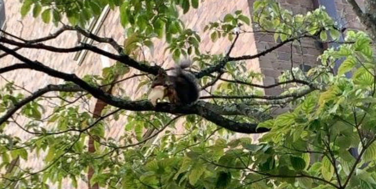

#### The purpose of Portfolio Piece 1 is to create interactive maps using the mapview package. In fall of 2020, my friend sent me a picture of a squirrel eating a large piece of pizza up in a tree. 




#### of New York City squirrel sightings in Central Park and New York City pizza restaurant locations.

### Data Credits 

[Data from NYC Squirrel Census](https://www.thesquirrelcensus.com/). Retrieved from [jonthegeek](https://github.com/rfordatascience/tidytuesday/tree/main/data/2019/2019-10-29) originally shared by Sara Stoudt. [Pizza Data](https://raw.githubusercontent.com/rfordatascience/tidytuesday/master/data/2019/2019-10-01/pizza_datafiniti.csv")

### Load squirrel data and packages 

```{r setup, include=FALSE}
knitr::opts_chunk$set(echo = TRUE)
```

```{r load-packages, message=FALSE}
library(tidyverse) 
```

```{r get-squirrel-data}
nyc_squirrels <- readr::read_csv("https://raw.githubusercontent.com/rfordatascience/tidytuesday/main/data/2019/2019-10-29/nyc_squirrels.csv")
```
### Squirrel fur color visualization 

```{r squirrel-color}
ggplot(data=nyc_squirrels, aes(x=primary_fur_color, fill = primary_fur_color)) + 
  geom_bar(stat = "count", width = 1) + 
  scale_fill_manual(values = c("black", "chocolate4","darkgrey")) + 
  labs(title="NYC Squirrel Fur Color", 
       xlab = "Number of Observations", 
       ylab = "Fur Color")
```

#### This visualization utilizes the scale_fill_manual function in order to customize the colors of the bars to match the fur color they represent. 

### Load pizza data 

```{r load-pizza-data}
pizza_datafiniti <- readr::read_csv("https://raw.githubusercontent.com/rfordatascience/tidytuesday/master/data/2019/2019-10-01/pizza_datafiniti.csv")
```

```{r filter-NY-only}
pizza_nyc <- pizza_datafiniti %>%
  filter(city == "New York")
```

```{r change-lat-long-column-title-pizza}
names(pizza_nyc)[names(pizza_nyc) == 'longitude'] <- 'long'
names(pizza_nyc)[names(pizza_nyc) == 'latitude'] <- 'lat'
```

### Combine squirrel and pizza data 

```{r combine-data}
nyc_squirrels <- nyc_squirrels %>% 
  mutate(source = "squirrels")
pizza_nyc <- pizza_nyc %>% 
  mutate(source = "pizza")
squirrels_and_pizza <- bind_rows(nyc_squirrels, pizza_nyc)
print(squirrels_and_pizza)
```


### NYC Squirrel sightings and pizza restuarant plot. 

```{r squirrels-and-pizza-plot}
ggplot(squirrels_and_pizza) + 
  geom_point(mapping = aes(x = long, y = lat,
  color = source)) + 
  labs(
    title= "New York City Pizza Restaurant Locations and Squirrel Sightings",
    x = "Longitude", 
    y = "Latitude"
    )
```

#### Install "sf" package in the R console by entering install.packages("sf"). Install "terra" package by entering "install.packages("terra) in the R console. 

```{r squirrel-map}
library(tidyverse)
library(sf)
library(mapview)
mapview(squirrels_and_pizza, xcol = "long", ycol = "lat", crs = 4269, grid = FALSE, zcol = "source")
```

### In Central Park, does this data support the idea that squirrels like pizza? 


